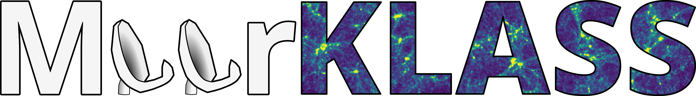

.. meerstack documentation master file, created by
   sphinx-quickstart on Tue Jul  9 17:09:07 2024.
   You can adapt this file completely to your liking, but it should at least
   contain the root `toctree` directive.

.. include:: ../../README.md
   :parser: myst_parser.sphinx_

Getting Started
===============
See :doc:`installation` for installation instructions.

Extensive tutorials and examples can be found in :doc:`cookbook`.

.. toctree::
   :maxdepth: 1
   :caption: Contents:

   installation
   develop
   examples
   cookbook
   contributors
   changelog
   meer21cm
